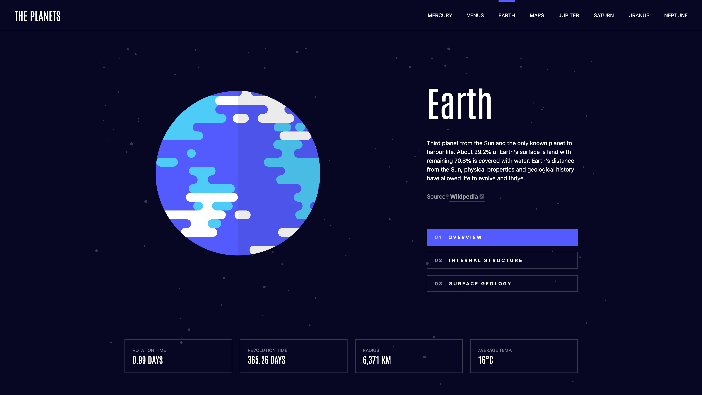
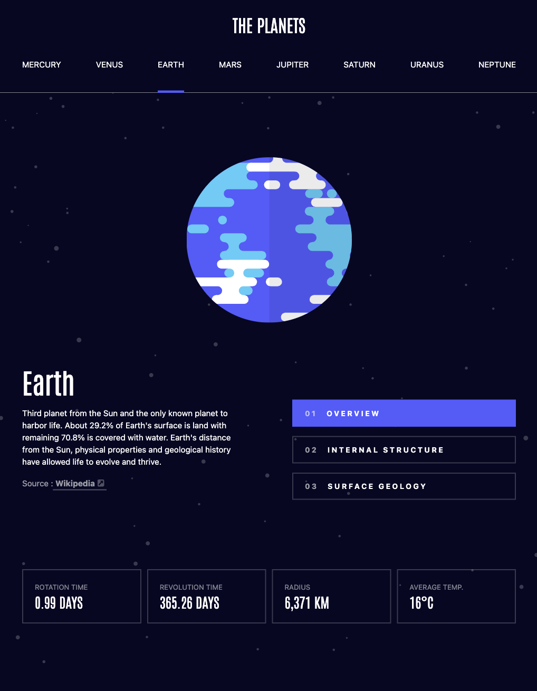
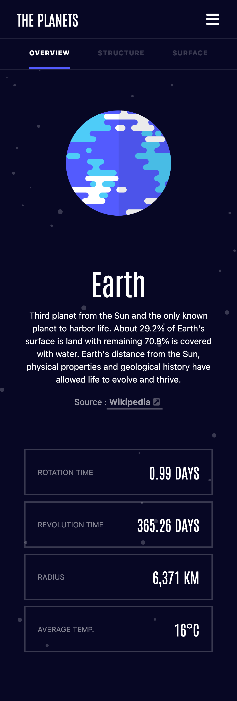
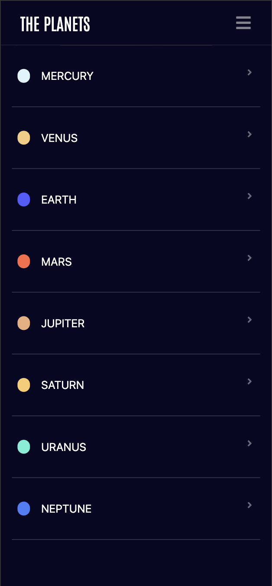

# Planet Facts - Frontend Mentor Challenge

Ce projet est une reproduction fidèle du défi [Planet Facts Site](https://www.frontendmentor.io/challenges/planets-fact-site-gazqN8w_f) de Frontend Mentor.  
Il a été réalisé avec **React**, **Tailwind CSS**, **React Router** et **Framer Motion**, dans le but de renforcer mes compétences en intégration responsive, animations, routing et structure d’application front-end moderne.

---

## Stack technique

- **React** – Gestion des composants, du state et du routing
- **Vite** – Outil de build ultra-rapide pour React
- **React Router** – Navigation entre les différentes planètes
- **Tailwind CSS** – Stylisation rapide et responsive
- **Framer Motion** – Animations fluides et personnalisées (menu mobile, transitions de texte, etc.)

---

## Objectifs

- Reproduire la maquette fournie sur [Frontend Mentor](https://www.frontendmentor.io)
- Rendre le site responsive mobile / tablette / desktop
- Ajouter des animations pour améliorer l’expérience utilisateur (UX)
- Créer un menu mobile animé
- Gérer dynamiquement l’affichage des données d’une planète
- Application d’un système de couleur dynamique

---

## Aperçus

### Version Desktop


### Version Tablette


### Version Mobile



---

## Ce que j’ai appris

- Utilisation combinée de `AnimatePresence` et `motion.div` pour des transitions entrantes/sortantes
- Structurer le projet en composants réutilisables afin d’optimiser l’organisation du code.
- Structuration claire du routing avec React Router
- Gestion du responsive avancé avec Tailwind

---

## Installation & Lancement

```bash
git clone https://github.com/MaximeNlr/planets-fact-site.git
cd planets-fact-site
npm install
npm run dev  # commande Vite pour lancer le serveur de dev
```